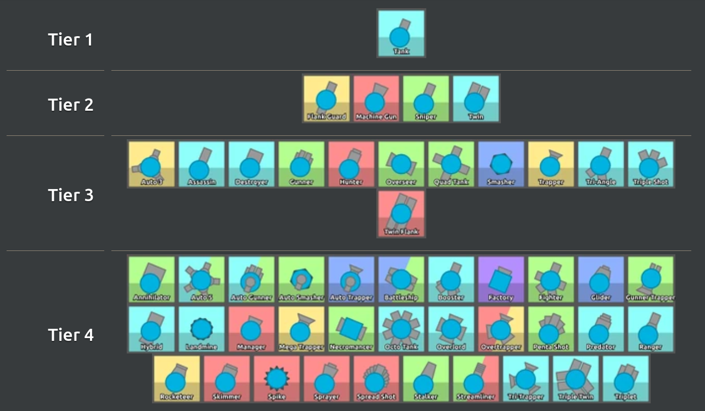
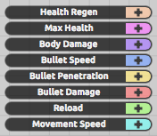
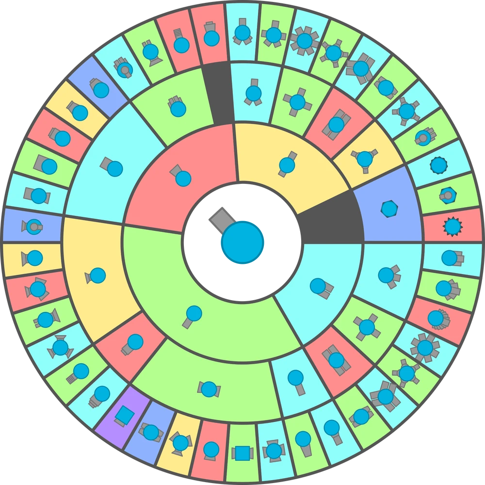

# Lab 1

## Part 1: Knowledge base + Prolog queries

> [!IMPORTANT]  
> I chose `diep.io` as a game. Basically, it's an online multiplayer game where
> people control toy 2d tanks of some weird geometric shapes to destroy each
> other, hence become bigger & more powerful themselves.

### Main Objects

- **Tanks**: Various types of tanks in the game.
- **Tank Classes**: Tanks divided into tiers(1-4), each representing upgrades.
- **Upgrades**: Relationships between different tanks and their corresponding
  upgrades.
- **Characteristics**: Attributes such as bullet damage, reload speed, e.t.c.
- **Abilities**: The abilities that each tank possesses.

---

### Tank Hierarchy

|  |
| ------------------------------ |

There are four tiers of tanks in the game:

1. **Tier 1**: Base tanks.
2. **Tier 2**: First level of upgrades.
3. **Tier 3**: Mid-level upgrades.
4. **Tier 4**: Final upgrades with specialized abilities.

Here is the hierarchy of tanks from the image provided:

| **Tier 1** | **Tier 2**  | **Tier 3**  | **Tier 4**     |
| ---------- | ----------- | ----------- | -------------- |
| Basic Tank | Flank Guard | Auto 3      | Annihilator    |
|            | Machine Gun | Assassin    | Auto 5         |
|            | Sniper      | Destroyer   | Auto Gunner    |
|            | Twin        | Gunner      | Auto Smasher   |
|            |             | Hunter      | Auto Trapper   |
|            |             | Overseer    | Battleship     |
|            |             | Quad Tank   | Booster        |
|            |             | Smasher     | Factory        |
|            |             | Trapper     | Fighter        |
|            |             | Tri-Angle   | Glider         |
|            |             | Triple Shot | Gunner Trapper |
|            |             | Twin Flank  | Hybrid         |
|            |             |             | Landmine       |
|            |             |             | Manager        |
|            |             |             | Mega Trapper   |
|            |             |             | Necromancer    |
|            |             |             | Octo Tank      |
|            |             |             | Overlord       |
|            |             |             | Overtrapper    |
|            |             |             | Penta Shot     |
|            |             |             | Predator       |
|            |             |             | Ranger         |
|            |             |             | Rocketeer      |
|            |             |             | Skimmer        |
|            |             |             | Spike          |
|            |             |             | Sprayer        |
|            |             |             | Spread Shot    |
|            |             |             | Stalker        |
|            |             |             | Streamliner    |
|            |             |             | Tri-Trapper    |
|            |             |             | Triple Twin    |
|            |             |             | Triplet        |

---

### Properties

|  |
| -------------------------- |

Each tank has a set of properties that defines its characteristics:

| Property           | Description                                      |
| ------------------ | ------------------------------------------------ |
| Bullet Damage      | The damage that bullets deal to enemies.         |
| Bullet Penetration | The ability of bullets to pass through objects.  |
| Reload Speed       | The speed at which the tank reloads its bullets. |
| Movement Speed     | The speed of the tank's movement across the map. |
| Health             | The amount of health the tank has.               |
| Bullet Speed       | The velocity at which bullets travel.            |

---

### Upgrades

Tanks follow a structured upgrade path:

---

### Now, after implementing knowledge base, let's implement queries for it
